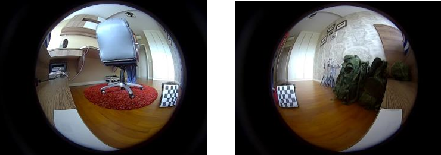
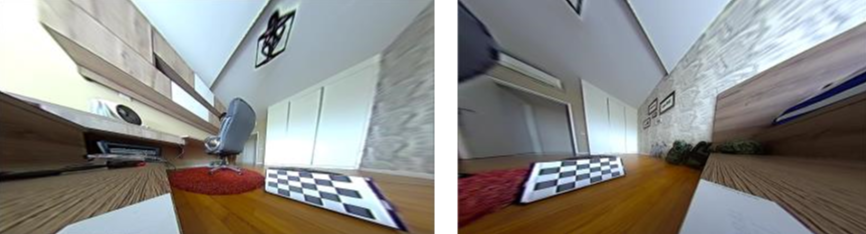
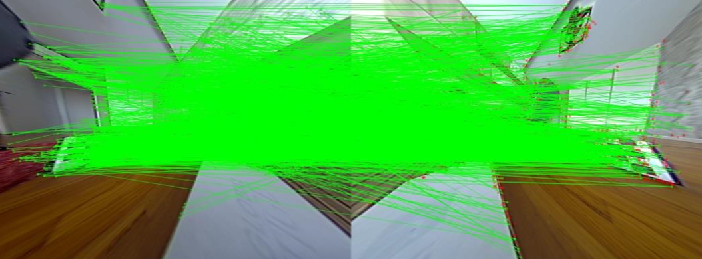
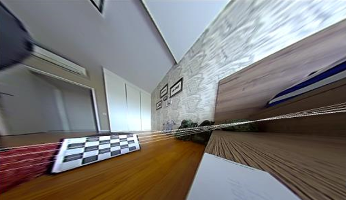
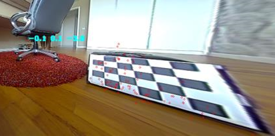

# sparse3D
Calibrates a pair of 180-degree stereo cameras and uses the parameters to calculate the real world locations of points in images taken from them.

### Usage:
``` ./[programName] [camAimg1.jpg] [camBimg1.jpg] [camAimg2.jpg] [camBimg2.jpg] ... [camAimgN.jpg] [camBimgN.jpg]```

Where camA and camB refer to the 2 cameras used in the stereo setup, and [camAimgN.jpg] refers to the Nth photo taken from camera A. The user needs to take images of a chessboard from both cameras, and repeat this at least 20 times, changing the position and orientation of the chessboard in between each pair of images taken from the 2 cameras (example shown below):



The user also needs to edit the following line to supply the intrinsic parameters and distortion coefficients for their camera setup:

```FileStorage file1("../data/180degreeCam3/180degreeCamera3Params1.xml", FileStorage::READ);```

As well as the following 2 lines to supply their own test images for the 3D point locations to be calculated:

```Mat imgATest = imread("../data/180degreeCam3/stereoCameras6/capture33.bmp"); ```
```Mat imgBTest = imread("../data/180degreeCam3/stereoCameras6/capture34.bmp");```
 
 ### Description:
 
The program first uses the multiple image pairs and pre-calculated camera parameters to undistort the images and find the locations of the chessboard corners on them. It compares the same chessboard corners on both images in a pair to calculate the rotation and translation vectors between cameras, as well as the essential and fundamental matrices.
 
 
 
Next, the test images are read from file and the SURF algorithm is used to find SURF features in both images. A FlannBasedMatcher object is used to match corresponding SURF keypoints on both images. 



To ensure the keypoints are matched accurately (i.e. such that the same physical location on both images is matched to each other), epipolar lines are calculated for each keypoint on the other image. For each keypoint on 1 image, the corresponding keypoint on the 2nd image is checked to see if it lies close to the calculated epipolar line. If it does not, it is treated as a mismatch and removed.



To further remove errors, the essential matrix is recalculated using the opencv findEssentialMat() function. However, instead of using the chessboard corner points as parameters for the calculation, the matching key points in both images are used instead. findEssentialMat() uses the RANSAC method, and which marks any outlying points that are not used for the calculation in the vector<uchar> outliers section. Hence, even though the new essential matrix is not used in the future, the by-product of marking these outlier points is useful for our purpose. These outliers are erased from the list of matching key points. 
 
Lastly, the remaining matching keypoint pairs are triangulated to find their physical, real-world locations w.r.t to one of the cameras. The points along with their location are drawn on the image, and the user can cycle through them with keypresses.


 
 


